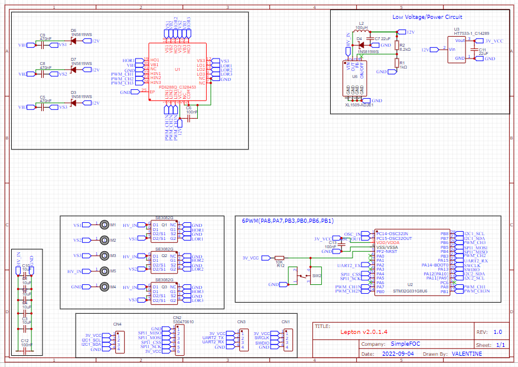
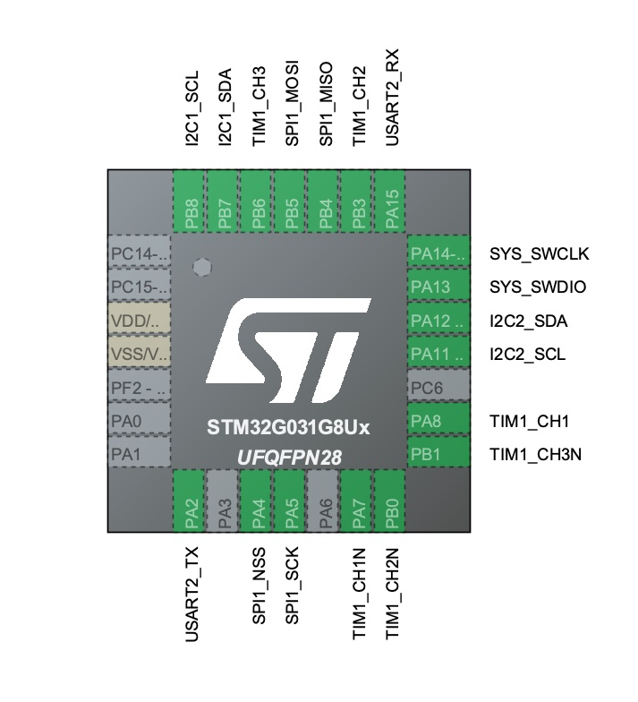

# SimpleFOC Lepton PlatformIO project

A sample [PlatformIO](https://platformio.org) project for the [SimpleFOC](https://simplefoc.com) compatible [Lepton BLDC driver](https://oshwlab.com/cost.co/20220903_bldc_se3082g_copy) board, based on a [STM32G031G8U6 MCU](https://www.st.com/en/microcontrollers-microprocessors/stm32g031g8.html).

Please see also the following thread in the [SimpleFOC Community](https://community.simplefoc.com/t/lepton-v2-revised-design-tested-working-30v-80a-mosfets/2489) for more information on the Lepton.

Feel free to clone/fork this repository to start your own Lepton-based project.

## Functions

Intended for use with chip's built-in bootloader, no extra bootloader needed.
Program using the SWD connection and a ST-Link programmer.

Power the board externally (ST-Link should not supply power).

Serial can be connected to the ST-Link V3's RX/TX pins or to another TTL Serial to USB adapter to interface with your PC.
The Lepton's RX/TX pins are mapped to the Arduino `Serial` object, so you can just use `Serial.begin(115200);` (for example).

In the same way, the Lepton's I2C port is mapped to the Arduino `Wire` object, and the Lepton's SPI port to the Arduino `SPI` object.

This should let you use the built in Serial, Wire (I2C) and SPI functions with no special setup code.

## Lepton schematic

Schematic for V2 or the lepton, [available on EasyEDA](https://oshwlab.com/cost.co/20220903_bldc_se3082g_copy).

## Pinout

Based on the following pin configuration:

## Clock

The project uses the following clock configuration:

